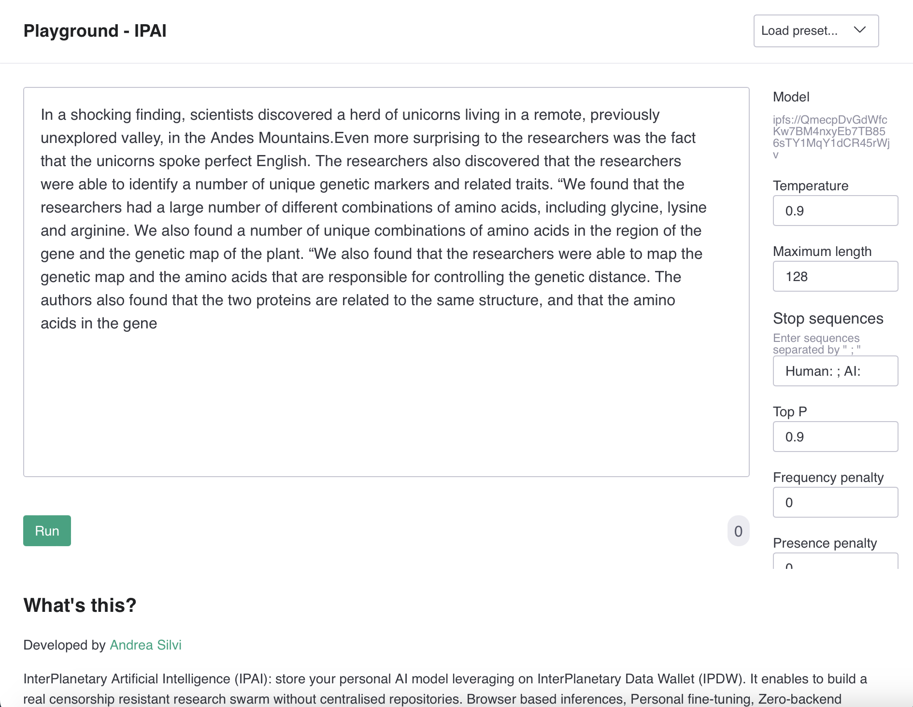

# ipai (InterPlanetary Artificial Intelligence)

InterPlanetary Artificial Intelligence (IPAI): store your personal AI model leveraging on InterPlanetary Data Wallet (
IPDW). It enables to build a real censorship resistant research swarm without centralised repositories. Browser based
inferences, Personal fine-tuning, Zero-backend privacy, and much more.

<p align="center"><em>Check it out the demo distributed via ipfs at <a href="https://ipfs.io/ipfs/QmW98fovtPYpdRHTyCM9v4qhe151Dn8iNPofibQ2e5T1bq/">https://ipfs.io/ipfs/QmW98fovtPYpdRHTyCM9v4qhe151Dn8iNPofibQ2e5T1bq/</a></em></p>



<p align="center"><em>Alternative access via other gateway or directly via ipfs:// protocol on supported browser using this IPFS CID QmW98fovtPYpdRHTyCM9v4qhe151Dn8iNPofibQ2e5T1bq/</em></p>


## Features

- Store your personal AI model on the InterPlanetary Data Wallet (IPDW)
- Publish a without centralized repositories
- Take advantage of browser-based inferences
- Personalize your AI model through fine-tuning
- Enjoy zero-backend privacy for your AI model
- And much more!

## Getting Started

To get started with IPAI, you will need to follow these steps:

Clone the repository:
```bash
$ git clone https://github.com/ansi-code/ipai.git
```

Install the required dependencies:
```bash
$ npm install
```

Follow the instructions provided in the IPDW repository to set up your wallet.

Start using IPAI.

```js
const model = await GPTNeoXForCausalLm.Load("ipfs://QmecpDvGdWfcKw7BM4nxyEb7TB856sTY1MqY1dCR45rWjv", console.log);
const tokenizer = await BertTokenizer.Load('ipfs://QmRnFHciVJxtpTtGktB3vLRMMxutEaAybXvwobXKLxRpd9', 'ipfs://QmQWBu2Cd4KnBGeeT9dx7JSG6v9VJg1QeiDg3EbBtSLKkD', console.log);

const prompt = "In a shocking finding, scientists discovered a herd of unicorns living in a remote, previously unexplored valley, in the Andes Mountains.\nEven more surprising to the researchers was the fact that the unicorns spoke perfect English.";
const inputIds = tokenizer.encode(prompt);

const genTokens = await model.generate(inputIds, true, 0.9, 1, 1, 150, async t => {
    process.stdout.write(tokenizer.decode([t]))
});

const genText = tokenizer.decode(genTokens);
console.log("Final text:", genText);
```

## Contributing

We welcome contributions to IPAI! If you would like to contribute, please follow these steps:

1. Fork the repository
2. Create a new branch for your changes
3. Commit your changes and open a pull request
4. Support

If you need help using IPAI or have any questions, please open an issue in this repository and we will be happy to assist you.

## TODO

- Migrate matrices computation to NumTs (https://github.com/ansi-code/numts)
- Custom sparse matrices backend

## License

This project is licensed under the Apache 2.0 License. See the [LICENSE](./LICENSE) file for details.
